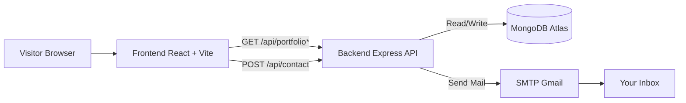

# Viman Kavinda Portfolio

A modern full-stack portfolio built with React, Vite, Tailwind CSS, Express, and MongoDB.


The project includes:
- A polished single-page portfolio frontend
- A backend API that serves portfolio data
- A contact workflow that sends an email and stores each message in MongoDB

## Architecture



## Highlights

- Responsive, animated UI with glassmorphism styling
- Centralized content model for personal info, skills, projects, and education
- Contact form with dual persistence:
	- Email delivery through Gmail SMTP
	- Database storage through Mongoose
- Clean API surface for frontend and future integrations

## Tech Stack

### Frontend
- React 18
- Vite 5
- Tailwind CSS 3
- Lucide React

### Backend
- Node.js
- Express
- MongoDB + Mongoose
- Nodemailer (SMTP)

## Repository Structure

```text
portfolio 2026-04-05/
├── backend/
│   ├── .env
│   ├── .env.example
│   ├── package.json
│   ├── server.js
│   └── src/
│       ├── app.js
│       ├── config/
│       │   └── db.js
│       ├── data/
│       │   └── portfolioData.js
│       ├── models/
│       │   └── ContactMessage.js
│       └── routes/
│           ├── contactRoutes.js
│           └── portfolioRoutes.js
├── portfolio/
│   ├── public/
│   │   ├── profile.jpeg
│   │   └── Viman_Kavinda_CV.pdf
│   ├── src/
│   └── package.json
└── package.json
```

## Getting Started

### 1) Install dependencies

From workspace root:

```bash
npm install
npm --prefix backend install
npm --prefix portfolio install
```

### 2) Configure environment

Copy backend env template:

```bash
copy backend\.env.example backend\.env
```

Set required values in backend/.env:

- MONGODB_URI
- SMTP_HOST
- SMTP_PORT
- SMTP_SECURE
- SMTP_USER
- SMTP_PASS
- CONTACT_TO_EMAIL
- CONTACT_FROM_EMAIL
- CORS_ORIGIN

### 3) Run in development

From workspace root:

```bash
npm run dev:frontend
```

In a second terminal (workspace root):

```bash
npm run dev:backend
```

Frontend defaults to Vite local port.
Backend defaults to http://localhost:5000.

## NPM Scripts

Workspace root scripts:

- npm run dev:frontend
- npm run dev:backend
- npm run build
- npm run preview

Frontend scripts (portfolio/package.json):

- npm run dev
- npm run build
- npm run preview

Backend scripts (backend/package.json):

- npm run dev
- npm run start

## API Reference

Base URL: http://localhost:5000

### Health
- GET /api/health

### Portfolio Data
- GET /api/portfolio
- GET /api/portfolio/personal
- GET /api/portfolio/skills
- GET /api/portfolio/projects
- GET /api/portfolio/education

### Contact
- POST /api/contact

Request body:

```json
{
	"name": "Your Name",
	"email": "you@example.com",
	"message": "Your message"
}
```

On success, the backend:
- saves the message in MongoDB collection contactmessages
- sends an email to CONTACT_TO_EMAIL

## Content and Assets

Update portfolio content in:
- portfolio/src/data.js

Add static assets in:
- CV: portfolio/public/Viman_Kavinda_CV.pdf
- Profile image: portfolio/public/profile.jpeg

## Deployment Notes

### Frontend
- Build with npm run build from workspace root
- Deploy portfolio/dist to Netlify, Vercel, or GitHub Pages

### Backend
- Deploy backend folder to a Node-compatible host
- Provide all backend environment variables
- Point frontend API URL to deployed backend if needed

## License

This project is for personal portfolio use.
